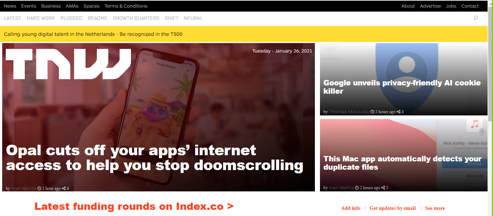
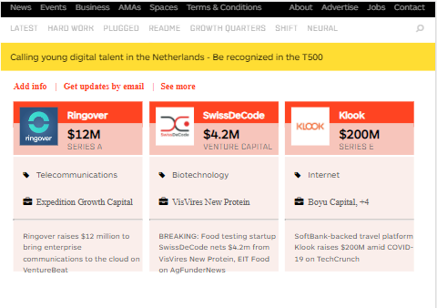
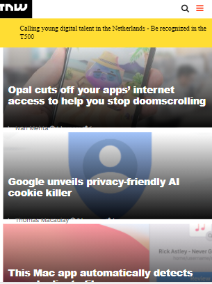

> In this Project you can see number of Responsive Web Design examples.
> In addition to this I have used grid and flex priperties in order to make it looks better.
> You can see different types of tags like main, div, footer, img, p, a, head, body, table, ...
> Below I attached three different appearance of the live page!

## Built With

- Major languages
<ul>
<li>HTML</li>
<li>CSS</li>
</ul>

- Technologies used
<ul>
<li>GitHub</li>
<li>Git</li>
<li>Visula Studio Code</li>
<li>Extensions
<ol>
<li>Live Server</li>
<li>Prettier</li>
<li>differeent types of Linters</li>
</ol>
</li>
</ul>

## Live Demo

[Live Demo Link](https://abdumurodovazulfizar.github.io/The-Next-Web-Repo/)

## Getting Started

**If you want to see use this project as a basis to create your own project feel free to fork 👍**

To get a local copy up and running follow these simple example steps.

## Authors

👩🏻‍💼 **Author1**

- GitHub: [@AbdumurodovaZulfizar](https://github.com/AbdumurodovaZulfizar)
- Twitter: [@Zulfiza70357085](https://twitter.com/Zulfiza70357085)
- LinkedIn: [LinkedIn](https://www.linkedin.com/in/zulfizar-abdumurodova-a61527206/)

🧑‍💼 **Author2**

- GitHub: [@marcosmerida](https://github.com/marcosmerida)
- LinkedIn: [LinkedIn](https://www.linkedin.com/in/marcos-merida-219437206/)

## 🤝 Contributing

Contributions, issues, and feature requests are welcome!

## Show your support

Give a ⭐️ if you like this project!

## Acknowledgments

- [Microverse](https://www.microverse.org/) for international opportunities and their `README` [template](https://github.com/microverseinc/readme-template).
- You can be software developer only if you want 😊

## 📝 License

Copyright 2021 Zulfizar Abdumurodova & Marcos Merida
- [MIT](https://github.com/AbdumurodovaZulfizar/The-Next-Web-Repo/blob/main/LICENSE.md) for this project.
